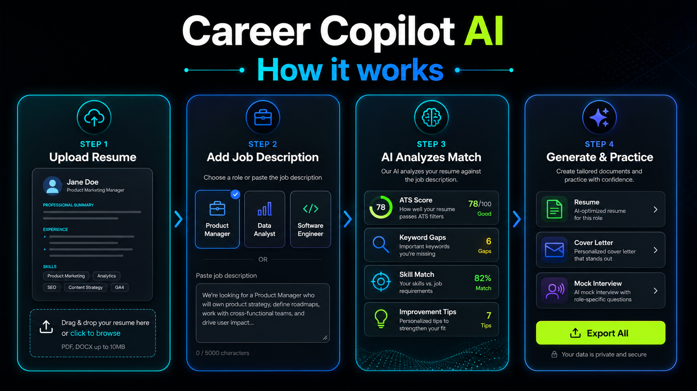

# Career Copilot AI

## About

**Career Copilot AI** is an intelligent AI-powered career guidance assistant that helps users navigate their career journey from learning to earning. The platform provides personalized career advice, skill assessments, resume generation, interview preparation, and job market intelligence specifically designed for Gen Z professionals and students.
- **Demo URL:** https://career-copilot-ai.netlify.app/




## How It Works

Career Copilot AI uses an agentic AI flow to orchestrate career planning:

1. **Input Collection:** Users upload their resume (PDF), job description, and prep timeline (2 weeks - 6 months)
2. **JD Analysis:** AI analyzes the job description and extracts key requirements
3. **Profile Extraction:** Candidate skills and experience are extracted from the resume
4. **Job Match Score:** Calculates compatibility percentage between candidate and job
5. **Skill Gap Identification:** Identifies missing skills required for the target role
6. **Roadmap Generation:** Creates a personalized weekly learning roadmap
7. **Resume & Cover Letter:** Generates custom resume and cover letter optimized for the job
8. **Mock Interviews:** Provides AI-powered technical and behavioral interview simulations with feedback

## Problem and Solution

### Problem
- Many underserved students lack access to career guidance and mentorship
- Job seekers struggle to customize resumes for specific roles
- Difficulty identifying skill gaps for target careers
- Limited access to realistic interview practice
- Career roadmaps are often generic, not personalized

### Solution
Career Copilot AI provides:
- ✅ Personalized career roadmaps based on user skills and goals
- ✅ AI-generated resumes and cover letters optimized for each job
- ✅ Skill gap analysis with micro-learning tasks 
- ✅ AI mock interviews with instant feedback 
- ✅ Job match scoring for targeted applications
- ✅ Local LLM usage (free version) for cost-effective AI

## Tech Stack

### Built With:
| Component | Technology |
|-----------|-----------|
| **Frontend** | React + Tailwind CSS + Vite  |
| **Backend** | Node.js + Express |
| **LLM** | Meta's LLaMA 3-70B-Instruct (local) |
| **Automation** | n8n (self-hosted)|
| **Storage** | Google Sheets API |
| **PDF Viewer** | react-pdf with overlay support |
| **Version Control** | Git + GitHub |
| **Hosting** | Netlify (Frontend) |

### Technologies Used:
- **Languages:** JavaScript, TypeScript
- **Frameworks:** React, Node.js, Express
- **AI/ML:** LLaMA 3-70B-Instruct, Generative AI, Agentic AI [web:2]
- **APIs:** Google Sheets API
- **Tools:** n8n, Vite, Tailwind CSS

## How to Deploy Locally

### Prerequisites
- Node.js (v16+)
- npm or yarn
- Git

### Installation Steps

1. **Clone the repository**
```bash
git clone https://github.com/durgaprasad-mokara/Career-Copilot-ai.git
cd Career-Copilot-ai
```

2. **Install dependencies**
```bash
npm install
```

3. **Set up environment variables**
Create a `.env` file in the root directory:
```env
LLAMA_API_URL=http://localhost:11434
GOOGLE_SHEETS_API_KEY=your_api_key
N8N_WEBHOOK_URL=your_n8n_url
```

4. **Run the backend**
```bash
npm run server
```

5. **Run the frontend**
```bash
npm run dev
```

6. **Access the application**
- Frontend: `http://localhost:5173`
- Backend: `http://localhost:3000`

## How to Deploy on Netlify (Server)

### Step 1: Prepare Your Project
```bash
# Build the frontend
npm run build
```

### Step 2: Netlify Setup
1. **Create a Netlify account** at [netlify.com](https://netlify.com)

2. **Install Netlify CLI** (optional, for CLI deployment)
```bash
npm install -g netlify-cli
```

3. **Deploy via CLI**
```bash
netlify deploy
netlify deploy --prod
```

### Step 3: Deploy via Git (Recommended)
1. Go to [Netlify Dashboard](https://app.netlify.com)
2. Click **"Add new site"** → **"Import an existing project"**
3. Choose **GitHub** and select `Career-Copilot-ai` repository
4. Configure build settings:
   - **Base directory:** (leave empty)
   - **Build command:** `npm run build`
   - **Publish directory:** `dist`
5. Click **"Deploy site"**

### Step 4: Set Environment Variables in Netlify
1. Go to **Site settings** → **Environment variables**
2. Add your environment variables:
   - `LLAMA_API_URL`
   - `GOOGLE_SHEETS_API_KEY`
   - `N8N_WEBHOOK_URL`

### Step 5: Configure Backend (if using separate backend)
For backend hosting, consider:
- **Netlify Functions** (for Node.js backend)
- **Render.com** or **Railway.app** (for full backend server)
- Update frontend API calls to point to backend URL


### Devpost Submission Details

#### Project Name (60 chars max)
